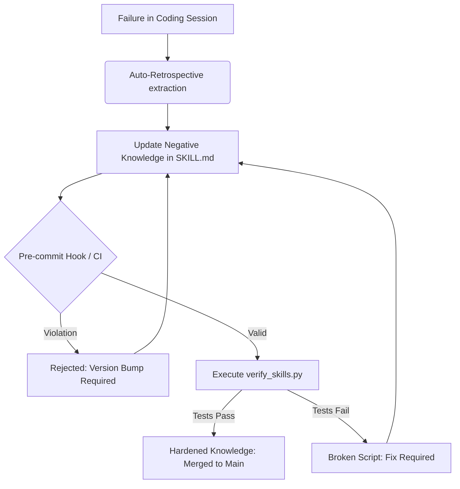

# Claude Code Learning Flywheel: Current Architecture

This document provides a technical overview of the "Learning Flywheel" architecture, detailing how it maintains code quality and institutional memory through automated governance and verification.

## 1. System Overview

The Flywheel is designed as a self-correcting knowledge system. It treats "Knowledge as Infrastructure," where every skill must be executable, verifiable, and governed by strict architectural rules.

## 2. Tiered Knowledge Layers

Knowledge is organized into three distinct tiers to balance local flexibility with global consistency:

| Layer | Path | Priority | Purpose |
|-------|------|----------|---------|
| **Personal** | `.claude/skills/` | 1 | Individual/Project-specific shortcuts and learnings. |
| **Team** | `plugins/team-playbook/` | 2 | Shared practices and playbooks for a specific team. |
| **Enterprise** | `plugins/company-standards/` | 3 | Organizational-wide standards and compliance. |

## 3. Core Components

### A. Modular Agents (`.claude/agents/`)

Specialized personas that act as gatekeepers or architects:

- **Standards Enforcer**: Enforces Negative Knowledge First and SOLID principles.
- **Knowledge Explorer**: Maps the codebase using LSP-first navigation.
- **Infrastructure Architect**: Manages dependencies and environment stability.

### B. Executable Skills (`.claude/skills/`)

Markdown files (`SKILL.md`) containing:

- **Triggers**: When the skill should be activated.
- **Negative Knowledge**: Documented failure modes and anti-patterns.
- **Zero-Context Scripts**: Executable Python/Bash scripts that perform the actual work.
- **Verification Metadata**: Links to tests that prove the skill works.

### C. Governance Engine (`scripts/`)

Automated scripts that implement the "Flywheel" logic:

- [validate_memory.py](file:///C:/workspaces/claude-code-learning-flywheel/scripts/validate_memory.py): Enforces versioning, context budgets, and Negative Knowledge presence.
- [pre_commit_governance.py](file:///C:/workspaces/claude-code-learning-flywheel/scripts/pre_commit_governance.py): Blocks anti-patterns (e.g., using `grep` instead of `cclsp` for navigation).
- [verify_skills.py](file:///C:/workspaces/claude-code-learning-flywheel/scripts/verify_skills.py): Runs the automated tests defined in skill frontmatter.

## 4. Primary Data Flow: The Knowledge Feedback Loop

The "Flywheel" is powered by a continuous feedback loop that transforms session failures into hardened infrastructure:

1. **Trigger**: A manual update or an `auto_retro.py` extraction adds a "Failed Attempt" to a skill.
2. **Versioning**: `validate_memory.py` detects the change. It mandates a semantic version bump to signal that the "Immune System" of the codebase has updated.
3. **Governance**: `pre_commit_governance.py` ensures the skill doesn't exceed the 500-line "Context Budget" and prioritizes LSP navigation.
4. **Verification**: `verify_skills.py` triggers the isolated test script (e.g., `tests/skills/test_git_commit_standards.py`).
5. **Integration**: Only after all checks pass is the knowledge considered "Safe" for the entire team.

## 5. Key Architectural Principles

- **Negative Knowledge First**: Prioritize documenting what *not* to do. failures are the high-octane fuel for the flywheel.
- **Zero-Context Scripts**: Move complex logic out of LLM prompts and into version-controlled scripts that are invisible to the context window until needed.
- **LSP-First Navigation**: Enforce the use of `cclsp` over `grep` to ensure agents understand code relationships, not just string matches.
- **Progressive Disclosure**: Only load the specific skill "References" or "Examples" when requested to keep the LLM context lean.
